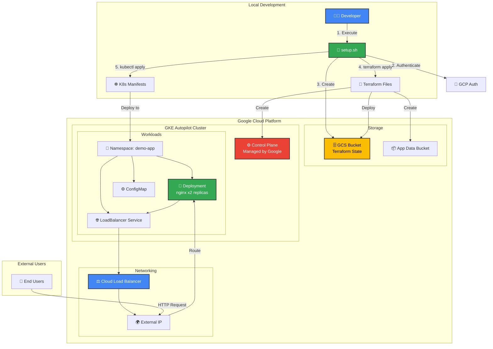
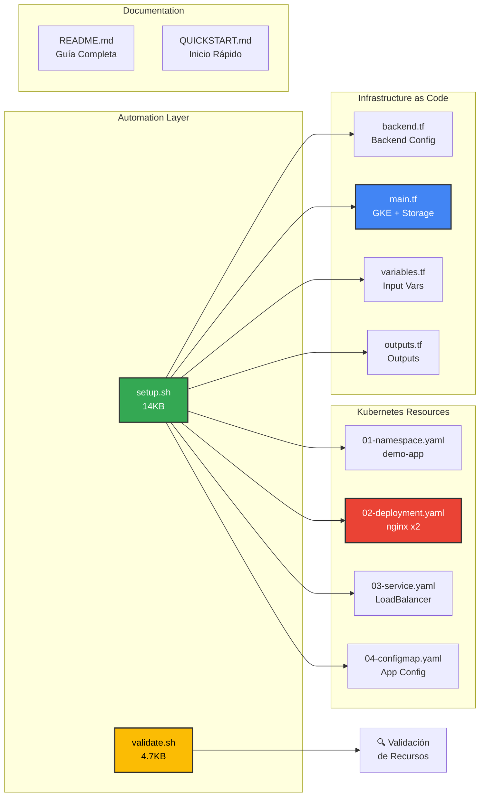

# GCP Infrastructure Setup - Guía de Uso

Este proyecto contiene un script de automatización robusto para desplegar infraestructura en Google Cloud Platform usando Terraform y Kubernetes.

## 🏗️ Arquitectura del Proyecto

### Diagrama de Infraestructura GCP



### Flujo de Automatización del Script

```mermaid
flowchart TD
    START([🚀 Inicio: ./setup.sh]) --> STEP1[📋 Paso 1: Verificar Herramientas]
    
    STEP1 --> CHECK1{gcloud, terraform,<br/>kubectl instalados?}
    CHECK1 -->|❌ No| ERROR1[❌ Error: Instalar herramientas]
    CHECK1 -->|✅ Sí| STEP2[🔐 Paso 2: Autenticación GCP]
    
    STEP2 --> CHECK2{Ya autenticado?}
    CHECK2 -->|No| AUTH[gcloud auth application-default login]
    CHECK2 -->|Sí| STEP3
    AUTH --> STEP3[⚙️ Paso 3: Configurar Proyecto]
    
    STEP3 --> INPUT1[Solicitar Project ID y Region]
    INPUT1 --> SETPROJ[gcloud config set project]
    SETPROJ --> STEP4[🗄️ Paso 4: Crear Bucket GCS]
    
    STEP4 --> CHECK3{Bucket existe?}
    CHECK3 -->|Sí| SKIP1[⏭️ Saltar creación]
    CHECK3 -->|No| CREATE1[gsutil mb + versioning]
    SKIP1 --> STEP5
    CREATE1 --> STEP5[🏗️ Paso 5: Terraform]
    
    STEP5 --> TF1[terraform init]
    TF1 --> TF2[terraform validate]
    TF2 --> TF3[terraform plan]
    TF3 --> CONFIRM{Usuario confirma<br/>terraform apply?}
    CONFIRM -->|No| SKIP2[⏭️ Saltar apply]
    CONFIRM -->|Sí| TF4[terraform apply]
    
    SKIP2 --> STEP6
    TF4 --> STEP6[☸️ Paso 6: Configurar kubectl]
    
    STEP6 --> GETCRED[gcloud container clusters<br/>get-credentials]
    GETCRED --> VERIFY[kubectl cluster-info]
    VERIFY --> STEP7[📦 Paso 7: Aplicar Manifiestos K8s]
    
    STEP7 --> CHECK4{Archivos YAML<br/>en /k8s?}
    CHECK4 -->|No| SKIP3[⏭️ Saltar deployment]
    CHECK4 -->|Sí| APPLY[kubectl apply -f k8s/*.yaml]
    
    SKIP3 --> SUCCESS
    APPLY --> CHECK5{Todos aplicados<br/>exitosamente?}
    CHECK5 -->|❌ No| ERROR2[❌ Error: Revisar manifiestos]
    CHECK5 -->|✅ Sí| SUCCESS([✅ Setup Completo!])
    
    ERROR1 --> END([🛑 Fin])
    ERROR2 --> END
    SUCCESS --> VALIDATE[🔍 Ejecutar ./validate.sh]
    VALIDATE --> END
    
    style START fill:#4285f4,stroke:#333,stroke-width:3px,color:#fff
    style SUCCESS fill:#34a853,stroke:#333,stroke-width:3px,color:#fff
    style ERROR1 fill:#ea4335,stroke:#333,stroke-width:2px,color:#fff
    style ERROR2 fill:#ea4335,stroke:#333,stroke-width:2px,color:#fff
    style VALIDATE fill:#fbbc04,stroke:#333,stroke-width:2px,color:#000
    style END fill:#666,stroke:#333,stroke-width:2px,color:#fff
```



### Componentes del Sistema



## 📋 Requisitos Previos

Antes de ejecutar el script, asegúrate de tener instalados:

- **Google Cloud SDK (gcloud)**: [Instrucciones de instalación](https://cloud.google.com/sdk/docs/install)
- **Terraform**: [Instrucciones de instalación](https://www.terraform.io/downloads)
- **kubectl**: [Instrucciones de instalación](https://kubernetes.io/docs/tasks/tools/)

## 🚀 Inicio Rápido

### 1. Ejecutar el Script

```bash
./setup.sh
```

El script te guiará a través de todo el proceso de configuración.

### 2. Configuración con Variables de Entorno (Opcional)

Puedes pre-configurar el script usando variables de entorno:

```bash
export GCP_PROJECT_ID="mi-proyecto-gcp"
export GCP_REGION="us-central1"
export GCS_BUCKET_NAME="mi-proyecto-terraform-state"
export GKE_CLUSTER_NAME="gke-autopilot-cluster"

./setup.sh
```

## 📁 Estructura del Proyecto

```
gcp-lab-all/
├── setup.sh              # Script principal de automatización
├── terraform/            # Configuración de Terraform
│   ├── main.tf
│   ├── variables.tf
│   ├── outputs.tf
│   └── backend.tf
├── k8s/                  # Manifiestos de Kubernetes
│   ├── deployment.yaml
│   ├── service.yaml
│   └── ingress.yaml
└── setup.log            # Log de ejecución (generado)
```

## 🔧 Qué Hace el Script

El script ejecuta los siguientes pasos automáticamente:

### **Paso 1: Verificación de Herramientas**

- Verifica que `gcloud`, `terraform` y `kubectl` estén instalados
- Muestra las versiones de cada herramienta

### **Paso 2: Autenticación GCP**

- Ejecuta `gcloud auth application-default login`
- Verifica si ya estás autenticado
- Permite re-autenticación si es necesario

### **Paso 3: Configuración del Proyecto**

- Solicita o usa el Project ID de GCP
- Configura la región (default: us-central1)
- Establece el proyecto activo

### **Paso 4: Bucket de Terraform Backend**

- Crea un bucket de GCS para el estado de Terraform
- Habilita versionado para protección del estado
- Configura acceso uniforme a nivel de bucket
- Nombre del bucket: `{PROJECT_ID}-terraform-state`

### **Paso 5: Terraform Init & Apply**

- Ejecuta `terraform init -upgrade`
- Valida la configuración
- Ejecuta `terraform plan`
- Solicita confirmación antes de aplicar
- Ejecuta `terraform apply`

### **Paso 6: Configuración de kubectl**

- Obtiene las credenciales del cluster GKE Autopilot
- Configura el contexto de kubectl
- Verifica la conexión al cluster

### **Paso 7: Aplicación de Manifiestos K8s**

- Aplica todos los archivos `.yaml` y `.yml` en `/k8s`
- Reporta el estado de cada aplicación
- Muestra los recursos desplegados

## 🎯 Características del Script

### ✅ Manejo de Errores

- Usa `set -euo pipefail` para detener en errores
- Captura errores con `trap`
- Mensajes de error descriptivos con número de línea

### 📝 Logging Completo

- Todos los pasos se registran en `setup.log`
- Códigos de color para fácil lectura:
  - 🔵 **AZUL**: Información
  - 🟢 **VERDE**: Éxito
  - 🟡 **AMARILLO**: Advertencias
  - 🔴 **ROJO**: Errores

### 🔒 Validaciones

- Verifica la existencia de directorios antes de usarlos
- Valida la configuración de Terraform
- Confirma la conexión al cluster antes de aplicar manifiestos

### 🔄 Idempotencia

- Detecta si los recursos ya existen
- Permite saltar pasos ya completados
- Solicita confirmación para re-autenticación

## 📖 Ejemplos de Uso

### Ejecución Básica

```bash
./setup.sh
```

### Ejecución con Configuración Previa

```bash
export GCP_PROJECT_ID="mi-proyecto-123"
export GCP_REGION="europe-west1"
./setup.sh
```

### Ver Logs

```bash
cat setup.log
```

### Verificar Recursos Desplegados

```bash
# Ver todos los recursos de Kubernetes
kubectl get all -A

# Ver clusters GKE
gcloud container clusters list

# Ver estado de Terraform
cd terraform && terraform show
```

## 🛠️ Troubleshooting

### Error: "gcloud not found"

```bash
# Instalar Google Cloud SDK
brew install --cask google-cloud-sdk
```

### Error: "terraform not found"

```bash
# Instalar Terraform
brew tap hashicorp/tap
brew install hashicorp/tap/terraform
```

### Error: "kubectl not found"

```bash
# Instalar kubectl
brew install kubectl
```

### Error de Autenticación

```bash
# Re-autenticar manualmente
gcloud auth application-default login
gcloud auth login
```

### Error: "Bucket already exists"

- El script detecta esto automáticamente y continúa
- Si necesitas usar un bucket diferente, configura `GCS_BUCKET_NAME`

### Error al Aplicar Manifiestos K8s

- Verifica que el cluster esté activo: `kubectl cluster-info`
- Revisa los logs: `cat setup.log`
- Aplica manualmente: `kubectl apply -f k8s/`

## 🔐 Seguridad

- El script usa `application-default` credentials para Terraform
- No almacena credenciales en el código
- El bucket de Terraform tiene versionado habilitado
- Se recomienda revisar el plan de Terraform antes de aplicar

## 📚 Próximos Pasos

Después de ejecutar el script exitosamente:

1. **Verificar Recursos**

   ```bash
   kubectl get all -A
   gcloud container clusters list
   ```

2. **Acceder al Cluster**

   ```bash
   kubectl config current-context
   kubectl get nodes
   ```

3. **Revisar Estado de Terraform**

   ```bash
   cd terraform
   terraform state list
   terraform output
   ```

4. **Monitorear Aplicaciones**

   ```bash
   kubectl logs -f deployment/mi-app
   kubectl describe pod <pod-name>
   ```

## 📞 Soporte

Si encuentras problemas:

1. Revisa `setup.log` para detalles del error
2. Verifica que todas las herramientas estén instaladas correctamente
3. Asegúrate de tener los permisos necesarios en GCP

## 📄 Licencia

Este proyecto es de código abierto y está disponible bajo la licencia MIT.
